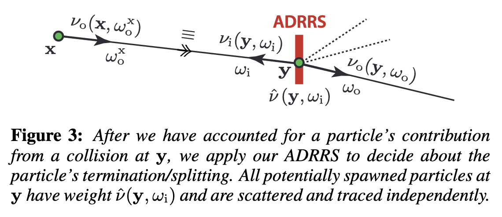
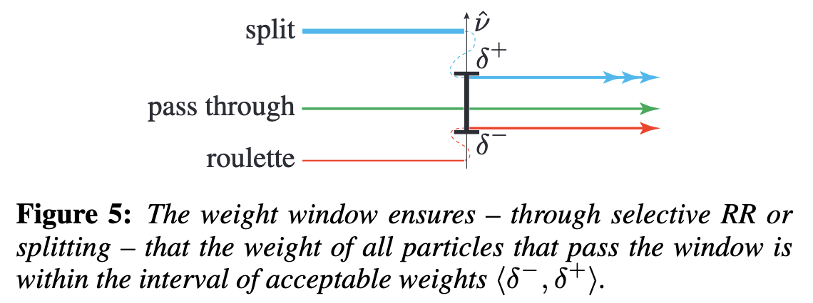
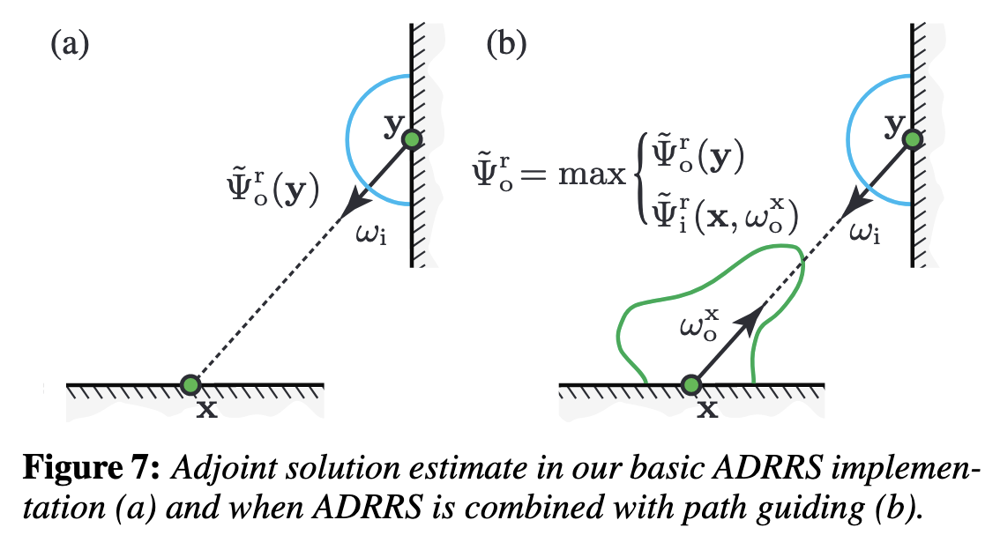
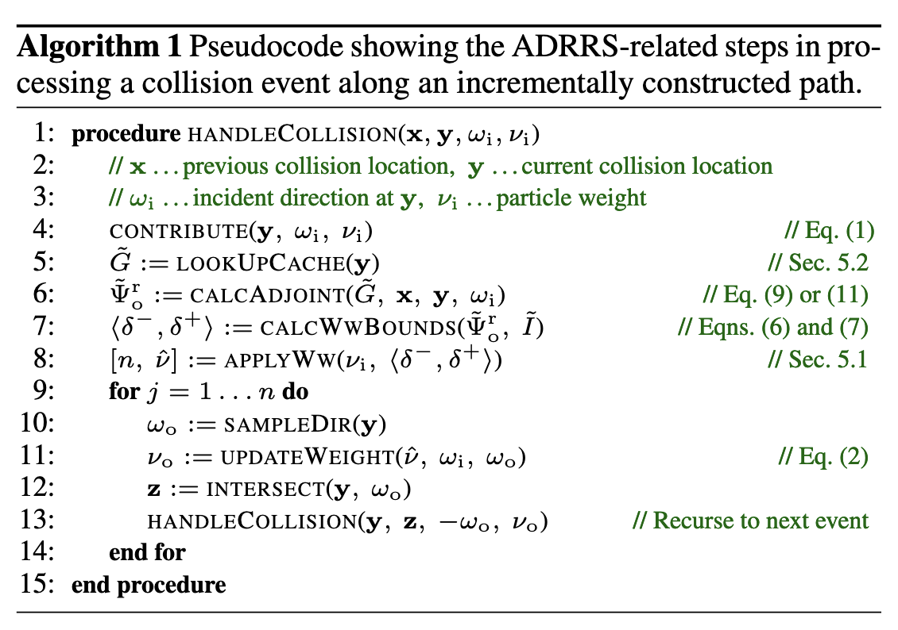

## 

borrows from neutron transport

estimate expected contribution of path as product of path weight & pre-computed estimate of adjoint transport solution

estimate generates "weight window" which keeps path contribution roughly constant; paths are terminated in unimportant regions and split in important regions

*adjoint-driven Russian roulette and splitting* (ADRRS) - terminate or split paths according to an estimate of their total expected contribution, relative to a *reference solution* (the adjoint)

- paths with higher contribution than expected are split
- paths with lower contrib. have higher chance of termination

**4.1 unified russian roulette & splitting**

- consider a particle that has just left a collision event at x. after sampling its outgoing direction and determining the next position y, contribute the source radiance from y to the solution then determine q(y, w_i) and if q < 1 play RR to terminate with new probability 1 - q. conversely if q > 1 split into q new paths and divide weight by q to compensate

  

**5.1 weight window**

- weight window defines an interval of acceptable particle weights $\langle\delta^-,\delta^+\rangle$
- above $\delta$, split - below $\delta$, RR

- weight window is centered on ""desired weight"" - precomputed estimate (adjoint solution)
- weight window relaxes impact of RR and splitting, increasing robustness to inaccuracies in measurement/adjoint estimates

**5.2 adjoint solution estimate**

Reflected outgoing adjoint $\tilde\Psi_o^r(y) = \frac{k(y)}{\pi}\tilde G(y)$

- cache of estimates with validity radius where any sample in the radius can reuse the estimate
- if no estimate, kernel density estimation computes new estimate from nearby particles
- $\tilde G$ is refined each iteration and its error estimated; ADRRS is applied at a collision only if the estimated error is below 30%, otherwise a globally fixed-size weight window is applied

- Init RR/split factor $q$ to 1 on first collision
- split at a collision limited to 100
- ray tree size disables splitting when splits in the tree are > 1000

Path guiding code of Vorba et. al [2014]

"On-line Learning of Parametric Mixture Models for Light Transport Simulation"

