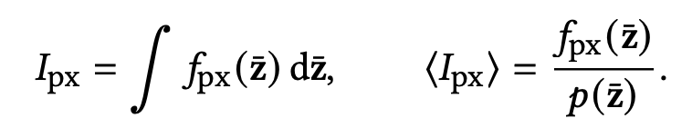
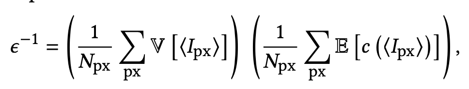
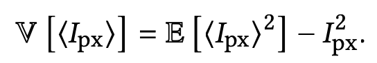
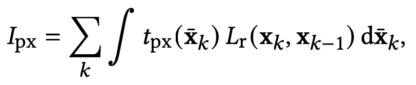
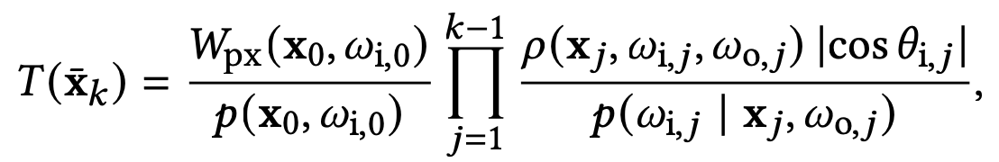
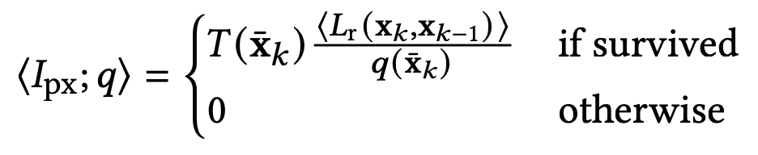
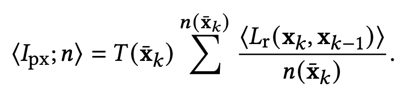

- expected contribution does not consider variance, cost of local estimators or global efficiency
- useful in scenes that exhibit indirect illumination via dark surfaces
- ears extends ADRRS with local variance and cost to split at the source of variance, reducing overall render time

**efficiency** - inverse of the product of variance and expected computational cost

over all paths $z$, 

for ears, rewrite pixel value as integral over all *prefix paths* $\bar{x}_k = x_0 ... x_k$

where $t_{px}$ is throughput, $L_r$ is reflected radiance at $x_k$ towards $x_{k-1}$ which is itself an integral given by the rendering equation.

weight of path $\bar{x}$ at depth $k$ gives path prefix $\bar{x}_k$ with weight

RR determines to terminate path

splitting reduces variance by continuing a path with $n$ addtl. independent samples

"the computed RRS factors are optimal under the constraint that exactly as many shadow rays need to be traced as BSDF samples."

splitting factor is determined as an average of component-wise (color-wise) variance estimation